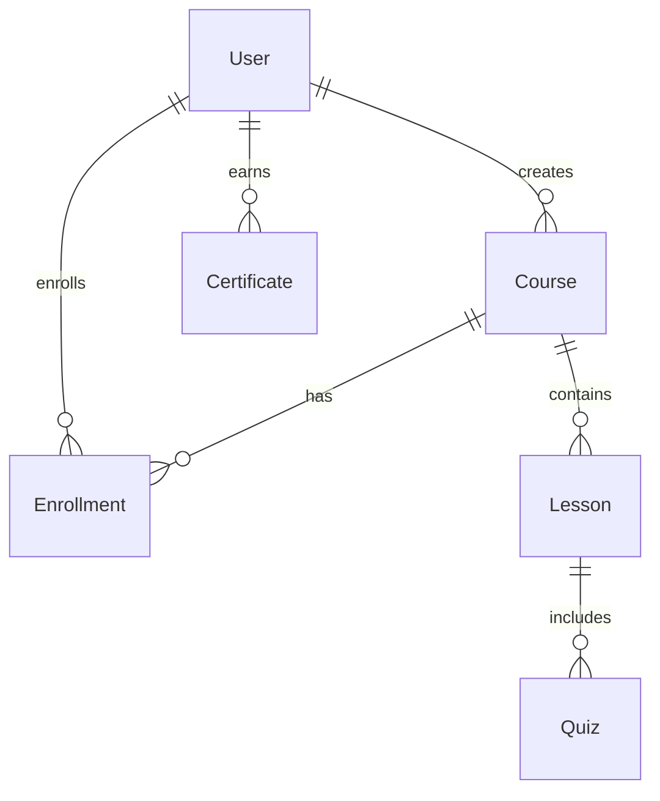

# NaijaLingua Development Methodology

## 🔄 Development Approach: Iterative Prototyping with Agile Principles

### Methodology Overview

This project followed a **hybrid approach** combining elements of:
- **Rapid Prototyping** for quick validation of core features
- **Iterative Development** with continuous refinement
- **Issue-Driven Development** responding to immediate technical challenges
- **Component-First Architecture** building reusable UI elements

### Development Phases

## Phase 1: Foundation & Setup ⚡
**Approach**: Infrastructure-First Development

**Activities Completed:**
- Project initialization with SvelteKit + TypeScript
- Database schema design using Prisma ORM
- Authentication system implementation (JWT + cookies)
- Environment configuration and deployment setup

**Key Decisions:**
- **SvelteKit Framework**: Chosen for SSR capabilities and developer experience
- **MongoDB Atlas**: Cloud-hosted NoSQL database for flexible schema and scalability
- **Tailwind CSS**: Utility-first styling for rapid UI development
- **Component-based Architecture**: Modular, reusable UI components

**Tools & Practices:**
```bash
# Development Stack
- SvelteKit (Full-stack framework)
- TypeScript (Type safety)
- Prisma ORM (Database management)
- Tailwind CSS (Styling)
- ESLint + Prettier (Code quality)
```

## Phase 2: Core Feature Implementation 🏗️
**Approach**: Feature-Driven Development

**User Stories Implemented:**
- User registration and authentication
- Course browsing and enrollment
- Learning dashboard with progress tracking
- Admin panel for content management

**Development Pattern:**
1. **Database-First Design**: Define schema for each feature
2. **API Route Implementation**: Server-side logic and validation
3. **UI Component Development**: Reusable Svelte components
4. **Integration Testing**: End-to-end functionality validation

**File Structure Strategy:**
```
src/
├── routes/           # File-based routing
│   ├── auth/        # Authentication flows
│   ├── courses/     # Course management
│   └── dashboard/   # User learning interface
├── lib/
│   ├── components/  # Reusable UI components
│   ├── db.ts       # Database connection
│   └── auth.ts     # Authentication utilities
└── app.css         # Global styles
```

## Phase 3: Technical Debt Resolution 🔧
**Approach**: Issue-Driven Refactoring

**Challenges Encountered:**
- **Svelte 5 Migration**: Legacy reactive statements (`$:`) to runes (`$derived`)
- **State Management**: Upgrading to `$state()` for reactive variables
- **Event Handling**: Deprecation of `on:click` in favor of `onclick`
- **Component Patterns**: Replacing `<svelte:component>` with dynamic imports

**Resolution Strategy:**
```typescript
// Before (Legacy Svelte)
$: isHomePage = $page.url.pathname === '/';
let mobileMenuOpen = false;

// After (Svelte 5 Runes)
const isHomePage = $derived($page.url.pathname === '/');
let mobileMenuOpen = $state(false);
```

**Technical Improvements:**
- Systematic replacement of deprecated patterns
- Enhanced type safety with strict TypeScript
- Performance optimization through proper reactive patterns
- Code consistency with ESLint rules

## Development Practices 📋

### Code Quality Standards
- **TypeScript Strict Mode**: All files use strict type checking
- **Component Reusability**: Shared components in `/lib/components/`
- **Consistent Naming**: PascalCase for components, camelCase for variables
- **Error Handling**: Proper error boundaries and user feedback

### Database Management
```sql
-- Migration-driven development
npx prisma migrate dev    # Development migrations
npx prisma generate      # Type generation
npx prisma studio       # Database inspection
```

### Testing Strategy (Planned)
- **Unit Tests**: Component-level testing with Vitest
- **Integration Tests**: API route testing
- **E2E Tests**: User journey validation with Playwright

## Deployment Strategy 🚀

### Environment Management
```bash
# Local Development
npm run dev

# Production Build
npm run build
npm run preview

# Database Operations
npm run db:push      # Schema sync
npm run db:migrate   # Run migrations
npm run db:seed      # Sample data
```

### Infrastructure
- **Hosting**: Vercel (optimized for SvelteKit)
- **Database**: MongoDB Atlas (cloud-hosted)
- **CDN**: Vercel Edge Network
- **Monitoring**: Built-in Vercel analytics

## Lessons Learned 📚

### What Worked Well
1. **Component-First Development**: Building reusable components early saved significant development time
2. **Type-Safe Development**: TypeScript caught numerous potential runtime errors
3. **Database-First Design**: Prisma schema guided API and component development
4. **Issue-Driven Fixes**: Addressing compilation errors led to modern, maintainable code

### Challenges & Solutions
1. **Framework Migrations**: Svelte 5 runes required systematic refactoring
   - **Solution**: Methodical replacement of deprecated patterns
2. **State Management**: Complex reactive state in components
   - **Solution**: Proper use of `$state()` and `$derived()` runes
3. **Development Environment**: Node.js version compatibility
   - **Solution**: Environment standardization and documentation

### Future Improvements
- **Automated Testing**: Implement comprehensive test suite
- **CI/CD Pipeline**: Automated deployment and quality checks
- **Performance Monitoring**: Real-time application performance tracking
- **User Analytics**: Learning progress and engagement metrics

## Development Timeline ⏱️

**Estimated Development Time:**
- Phase 1 (Foundation): ~2-3 days
- Phase 2 (Core Features): ~3-4 days  
- Phase 3 (Refinement): ~1-2 days
- **Total**: ~6-9 days of active development

**Key Milestones:**
- ✅ Project setup and authentication
- ✅ Course management system
- ✅ User dashboard implementation
- ✅ Svelte 5 migration and modernization
- 🔄 Testing and deployment optimization

## Conclusion

The NaijaLingua project demonstrates successful application of **iterative development** principles, where each phase built upon the previous while maintaining flexibility to adapt to technical challenges. The combination of modern web technologies with systematic development practices resulted in a scalable, maintainable language learning platform.

The methodology proved particularly effective for:
- Rapid feature implementation
- Technical debt management
- Framework migration handling
- Maintaining code quality standards

This approach is recommended for similar educational technology projects requiring both rapid development and long-term maintainability.
- **Tutors**: Content creation (requires approval)
- **Admins**: Full platform management

## 🎨 Design Philosophy

### Cultural Authenticity
- **Nigerian color palette**: Green, orange, cream reflecting the flag and landscape
- **Typography choices**: DM Serif Display for cultural elegance, Inter for modern readability
- **Visual elements**: Incorporated Nigerian cultural motifs and patterns

### Mobile-First Approach
```css
/* Responsive design strategy */
.container {
  @apply px-4 sm:px-6 lg:px-8; /* Progressive spacing */
}

.grid-responsive {
  @apply grid grid-cols-1 md:grid-cols-2 lg:grid-cols-3; /* Flexible layouts */
}
```

### Accessibility Standards
- **WCAG 2.1 AA compliance**: Color contrast, keyboard navigation
- **Screen reader support**: Semantic HTML and ARIA labels
- **Progressive enhancement**: Core functionality without JavaScript

## 📊 Data Model Design

### Core Entities Relationship



### Schema Evolution Strategy
- **Prisma migrations**: Version-controlled schema changes
- **Backwards compatibility**: Careful field additions and deprecations
- **Data integrity**: Foreign key constraints and validation

## 🔧 Development Workflow

### Feature Development Process

1. **Planning Phase**
   - User story definition
   - Technical specification
   - Database schema updates
   - UI/UX mockups

2. **Implementation Phase**
   - Database migrations
   - API endpoint development
   - Component creation
   - Integration testing

3. **Quality Assurance**
   - Unit testing with Vitest
   - Type checking with TypeScript
   - Code formatting with Prettier
   - Linting with ESLint

4. **Deployment Pipeline**
   - Automated testing on PR
   - Preview deployments
   - Production deployment
   - Monitoring and analytics

### Code Organization Principles

**Component Structure**
```
components/
├── ui/           # Basic UI components (Button, Input, Card)
├── forms/        # Form-specific components
├── navigation/   # Header, Footer, Sidebar
└── features/     # Feature-specific components
```

**Utility Organization**
```typescript
// lib/utils.ts - Pure utility functions
export function formatLanguage(language: Language): string

// lib/auth.ts - Authentication utilities
export function verifyToken(token: string): JWTPayload | null

// lib/validators.ts - Zod schemas
export const courseSchema = z.object({...})
```

## 🚀 Performance Optimization

### Frontend Optimizations

**Code Splitting**
- Route-based splitting automatically handled by SvelteKit
- Component lazy loading for non-critical features
- Dynamic imports for heavy libraries

**Asset Optimization**
- Image optimization with responsive sizes
- Font preloading for improved LCP
- SVG icons for scalability and performance

**Caching Strategy**
```javascript
// Service worker for offline capabilities
const CACHE_NAME = 'naijalingua-v1';
const OFFLINE_URLS = ['/offline', '/courses'];
```

### Backend Optimizations

**Database Query Optimization**
```typescript
// Efficient data fetching with includes
const courses = await db.course.findMany({
  include: {
    lessons: { select: { id: true } }, // Only fetch needed fields
    _count: { select: { enrollments: true } }
  }
});
```

**API Response Optimization**
- JSON response compression
- Proper HTTP caching headers
- Pagination for large datasets

## 🔐 Security Implementation

### Data Protection
- **Password hashing**: bcrypt with salt rounds
- **Input validation**: Zod schemas on all endpoints
- **SQL injection prevention**: Prisma parameterized queries
- **XSS protection**: Content sanitization

### Privacy Compliance
- **Data minimization**: Only collect necessary information
- **User consent**: Clear terms and privacy policy
- **Data portability**: Export functionality for user data
- **Right to deletion**: Account deletion with data cleanup

## 🌍 Internationalization Strategy

### Multi-language UI Support
```typescript
// Future i18n implementation
const translations = {
  en: { welcome: 'Welcome' },
  yo: { welcome: 'Ẹ kú àbọ̀' },
  ig: { welcome: 'Nnọọ' },
  ha: { welcome: 'Barka da zuwa' }
};
```

### Content Localization
- **Language-specific content**: Native speaker audio
- **Cultural context**: Region-appropriate examples
- **Right-to-left support**: Future Arabic script languages

## 📈 Scalability Considerations

### Performance Scaling

**Horizontal Scaling**
- Stateless server design
- Database connection pooling
- CDN for static assets
- Load balancing ready

**Vertical Scaling**
- Efficient memory usage
- Optimized database queries
- Caching strategies
- Background job processing

### Feature Scaling

**Modular Architecture**
```typescript
// Feature-based organization
src/
├── features/
│   ├── courses/
│   ├── assessments/
│   ├── certificates/
│   └── community/
```

**Plugin System**
- Extensible quiz types
- Custom lesson formats
- Third-party integrations
- Community-contributed content

## 🧪 Testing Strategy

### Testing Pyramid

**Unit Tests (70%)**
```typescript
// Component testing
import { render, screen } from '@testing-library/svelte';
import CourseCard from './CourseCard.svelte';

test('displays course information correctly', () => {
  render(CourseCard, { course: mockCourse });
  expect(screen.getByText('Yoruba Basics')).toBeInTheDocument();
});
```

**Integration Tests (20%)**
- API endpoint testing
- Database integration tests
- Authentication flow tests

**E2E Tests (10%)**
- User journey testing
- Cross-browser compatibility
- Mobile responsiveness

### Quality Metrics
- **Code coverage**: Minimum 80%
- **Performance budget**: < 3s initial load
- **Accessibility**: WCAG 2.1 AA compliance
- **SEO**: Lighthouse score > 90

## 🔄 Continuous Integration/Deployment

### Development Pipeline

```yaml
# GitHub Actions workflow
name: CI/CD Pipeline
on: [push, pull_request]
jobs:
  test:
    - Type checking
    - Unit tests
    - Linting
    - Security scanning
  
  deploy:
    - Build application
    - Deploy to preview (PR)
    - Deploy to production (main)
```

### Monitoring Strategy
- **Error tracking**: Sentry integration
- **Performance monitoring**: Web Vitals
- **User analytics**: Privacy-focused analytics
- **Database monitoring**: Query performance

## 🎓 Educational Methodology

### Learning Science Integration

**Spaced Repetition**
- Review algorithms for vocabulary
- Progressive difficulty increase
- Adaptive learning paths

**Multimedia Learning**
- Visual, auditory, and kinesthetic elements
- Cultural context integration
- Interactive exercises

**Assessment Design**
- Formative assessments (quizzes)
- Summative assessments (course completion)
- Self-assessment tools
- Peer review capabilities

### Content Creation Standards

**Quality Assurance**
- Native speaker validation
- Cultural accuracy review
- Educational effectiveness testing
- Accessibility compliance

**Content Structure**
- Logical progression
- Clear learning objectives
- Regular checkpoints
- Cultural immersion

## 🌟 Innovation Areas

### Future Technology Integration

**AI/ML Capabilities**
- Pronunciation analysis
- Personalized learning paths
- Content recommendation
- Automated content generation

**Emerging Technologies**
- AR/VR language immersion
- Voice recognition improvements
- Real-time collaboration
- Blockchain certificates

### Community Features
- Language exchange matching
- Cultural event integration
- Storytelling platforms
- Peer mentoring programs

---

This methodology document serves as a living guide for the continued development and evolution of NaijaLingua, ensuring we maintain our commitment to quality, cultural authenticity, and educational excellence while embracing technological innovation.
